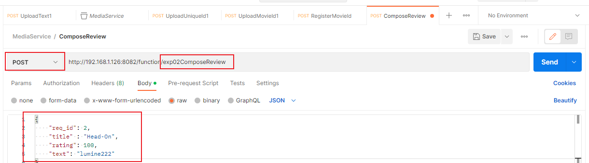

# EXP02 : MediaService

## Workload architecture

## Pre-requirements

```shell
# lib
sudo apt-get install -y libzstd-dev libssl-dev libz-dev

# mongo-c-driver
sudo apt-get install -y libmongoc-dev libbson-dev libbson-1.0-0

# boost
sudo apt install libboost-all-dev
```

## Installation

### Building

CLion recommended.

### Third-party service

- memcached & mongodb

```shell
cd k8s/
kubectl apply -f third-party.yml
```

### Running

```shell
cd scripts/
bash start_all_launcher.sh
```

## Evaluation

### Before you start

```shell
cd scripts/
python3 register_movieid.py

```

### Running HTTP workload generator

```shell
cd scripts/
bash invoke.sh 
```

### Invocation



### Repeat Test

clear the database
```shell
python clean.py
```
## Result

Experiment result in 2023.2.23

Method: IPC, DRC_OVER_IPC

Setup: Each function has 10 instance, wrk has 1 thread and 1 connection.

Some Note:
- The latency drops as throughput increases because with high throughput many requests will hit the memcache and then there is no need to check mongoDB
- Please set the interval in the wrk lua script large enough to avoid duplication of req_id 
### Result of DRC_OVER_IPC
| R10    | R100    | R1000   | Percentage |
| ------ | ------- | ------- | ---------- |
| 7.71ms | 6.96ms  |  6.61ms | 50.00%     |
| 8.26ms |  7.26ms |  6.89ms | 75.00%     |
| 8.48ms |  8.15ms |  7.31ms | 90.00%     |
| 8.78ms |  8.74ms |  9.41ms | 99.00%     |


### Result of IPC
| R10    | R100   | R1000  | Percentage |
| ------ | ------ | ------ | ------ |
| 10.32ms |  9.94ms |  9.06ms | 50.00% |
| 10.90ms | 10.18ms |  9.22ms | 75.00% |
| 11.54ms | 10.49ms |  9.50ms | 90.00% |
| 13.23ms | 11.68ms | 10.21ms | 99.00% |


### Max Throughput

Experiment result in 2023.2.24 (Possible interference by K8S cluster environment )

setup: -d60s -c10 -t1 -R1000,10instance

QPS of DRC_OVER_IPC: 902

QPS of IPC: 640

